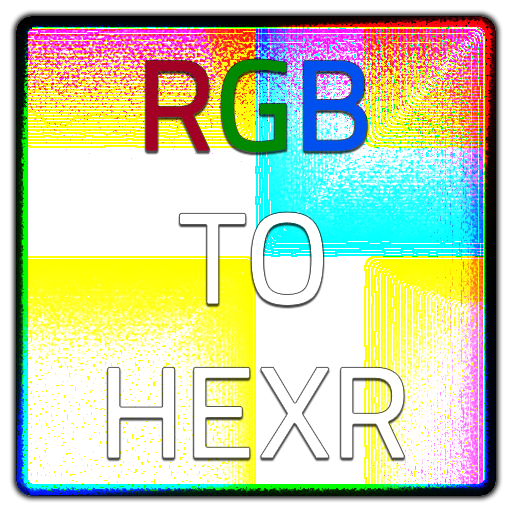
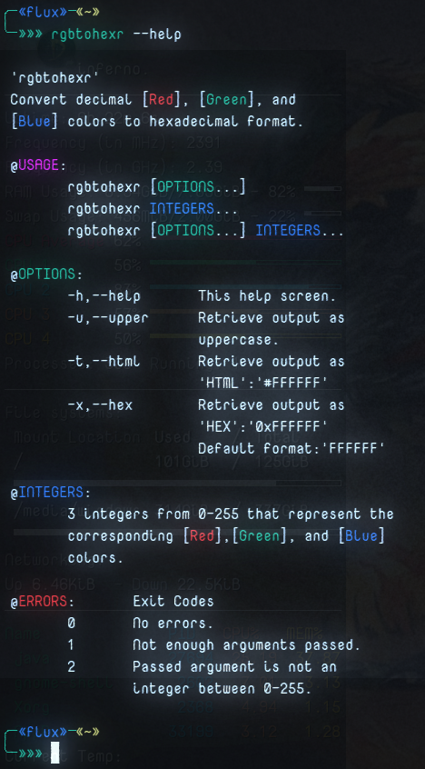
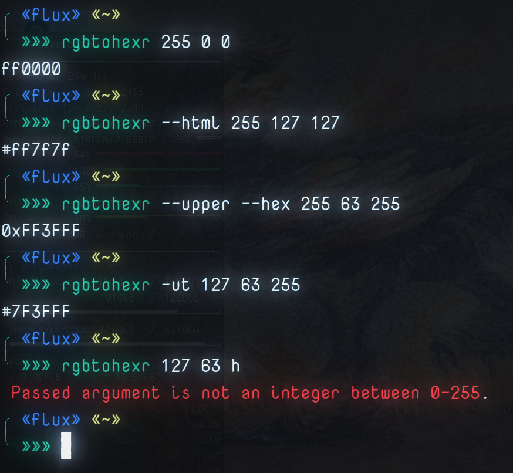

# RGBToHexR



<a class="twitter-share-button"
  href="https://twitter.com/share?ref_src=twsrc%5Etfw&text=%27rgbtohexr%27+-+Convert+decimal+red%2C+green+and+blue+colors+to+hexadecimal+format+from+the+command+line+with+a+few+options...%0D%0A%0D%0ACross-platform+for+%23Windows%2C+%23Linux%2C+and+%23MacOs+written+in+%23RustLang%0D%0A%23Programming+%23Coding+via+%40thefluxapex%0D%0A%0D%0A"></a> this project.

<a href="#examples"></a>

<a href="#file-links"></a>

---

**IMPORTANT NOTE**

<details>
<summary>Under Construction</summary>
This project will be completely re-structured OR possibly re-written in C++.
This program still works fine, but this workflow is horrible and I can personally do a better job in C++.
</details>

---

 - [RGBToHexR](#rgbtohexr)
	- [About](#about)
		- [Description](#description)
			- [Environment](#environment)
			- [Cross Platform](#cross-platform)
			- [Motivation](#motivation)
	- [Usage](#usage)
		- [Testing](#testing)
		- [Deployment](#deployment)
		- [File Permissions](#file-permissions)
		- [Installation](#installation)
			- [Debian Installer](#debian-installer)
				- [Install By (Double) Clicking](#install-by-double-clicking)
				- [Install Command Line Method](#install-command-line-method)
				- [Uninstall Command  Line Method](#uninstall-command--line-method)
			- [Portable Usage](#portable-usage)
				- [Operating System PATH](#operating-system-path)
		- [Environment Usage](#environment-usage)
			- [Operating System Environment](#operating-system-environment)
			- [Command Line Environment](#command-line-environment)
		- [Examples](#examples)
	- [Links](#links)
		- [Project Links](#project-links)
		- [File Links](#file-links)
	- [Project Status](#project-status)
		- [Overall Status](#overall-status)
		- [Latest Version Status](#latest-version-status)
			- [Latest Build Status](#latest-build-status)
	- [Notes](#notes)
	- [Media](#media)
		- [Logo](#logo)
		- [Screen Shots](#screen-shots)
			- [Help Screen](#help-screen)
			- [Demo Screen](#demo-screen)
	- [LICENSE](#license)

## About

### Description

Convert decimal red, green and blue colors to hexadecimal format from the command line with a few options...

#### Environment

This is a command line utility written in the *Rust* programming language.

#### Cross Platform

This should work in command lines in **Linux**, **Windows**, &amp; **MacOs**. 

#### Motivation

I do a lot with color in various environments from *web &amp; graphic design* to *programming* and I do many things from the *command line* and I wanted a more `programmatic` method than my normal various functions/scripts across various environments and languages that do the same, but I can instead just use this one program across any environment.

## Usage

This is a *cross-platform* command line tool in binary executable format that can be used in *command lines*/*consoles*/*terminals*/*ttys*/*shells* in **Linux**, **Windows**, and **MacOs**.

This program's name has various versions, but they should all be renamed to: `rgbtohexr`.

### Testing

This was written in *Linux*, but tested in *Linux* and *Windows*. Sorry *MacOs* users; I do not have a Mac, but I do know the operating system well and it has been written properly for the system had compiled successfully as can be seen in this repositories build history and should run fine. Please let me know if it doesn't.

### Deployment

This is currently provided as a compiled binary that is either portable or can be installed in *Linux* with the  *Debian* - **`.deb`**<sup>[[1](#note1)]</sup> package installer, but if there's enough interest I can also provide an ***AppImage***<sup>[[2](#note2)]</sup> at some point.

### File Permissions

 The main program file is meant to be executable and in *Windows* that's not usually an issue, but in *Linux* and *MacOs* you may need to set the permissions.

 In a *Linux* or *MacOs* command line run:

```Bash
# executable for all users
chmod +x /path/to/rgbtohexr
# or
chmod 755 /path/to/rgbtohexr 
# executable for current user only
chmod u+x /path/to/rgbtohexr 
```

### Installation

This program is portable, but there is a *Debian* (*.deb* file) package installer for the *Linux* binary version.

#### Debian Installer

The file: *rgbtohexr.deb* is a *Linux Debian* package installer for use on most *Linux Debian* based operating systems.

##### Install By (Double) Clicking

Like many other executable files this should be able to be clicked or double clicked to execute and it should open in the systems software manager gui.

##### Install Command Line Method

Install from command line with:

```Bash
sudo dpkg -i /path/to/rgbtohexr.deb
```

I imagine this can be installed with *gdebi*, but I'm not familiar with it.

Uninstall with:

##### Uninstall Command  Line Method

```Bash
sudo apt remove rgbtohexr
# -y to skip prompt approval
```

#### Portable Usage

Portable applications do not need to be installed, but they are easier to use if they are in one of a systems `PATH` directories.

If the program file is not in `PATH` (or in the current directory) then you must run it with the complete path url:

```Shell
/path/to/rgbtohexr --help
```

or

```PowerShell
& '\Path\To\rgbtohexr.exe' --help
```

If the file is place in `PATH` then you can run it with:

```Shell
rgbtohexr --help
```

##### Operating System PATH

`PATH` directories are stored and can listed in the various operating systems `PATH` variable.

E.g.
```Shell
echo "$PATH"
```

|Operating System|Variable Name|
|:---:|:---:|
|Linux|$PATH|
|MacOs|$PATH|
|Windows|%PATH%|

### Environment Usage

Used in many command lines across 3 main operating systems (and more). 

#### Operating System Environment

3 main operating systems:

- Linux
- Windows
- MacOs

#### Command Line Environment

Used in any command line environment from *Linux Shell* to *Windows PowerShell*.

- Windows
  - CMD
  - PowerShell
- Linux
  - Shell
  - Bash
  - Zsh
  - many more...
- MacOs
  - Same as Linux I imagine.

### Examples

A few random examples:

```Bash
╭─«flux»─«~» 
╰─»»» rgbtohexr 255 0 0                 
ff0000
╭─«flux»─«~» 
╰─»»» rgbtohexr --html 255 127 127      
#ff7f7f
╭─«flux»─«~» 
╰─»»» rgbtohexr --upper --hex 255 63 255
0xFF3FFF
╭─«flux»─«~» 
╰─»»» rgbtohexr -ut 127 63 255
#7F3FFF
╭─«flux»─«~» 
╰─»»» rgbtohexr 127 63 h
 Passed argument is not an integer between 0-255.
╭─«flux»─«~» 
╰─»»» 
```

The Help screen:

```Bash
╭─«flux»─«~» 
╰─»»» rgbtohexr --help       

 'rgbtohexr'
 Convert decimal [Red], [Green], and
 [Blue] colors to hexadecimal format.
 
 @USAGE:
        rgbtohexr [OPTIONS...]
        rgbtohexr INTEGERS...
        rgbtohexr [OPTIONS...] INTEGERS...

 @OPTIONS:
        -h,--help       This help screen.
        -u,--upper      Retrieve output as
                        uppercase.
        -t,--html       Retrieve output as
                        'HTML':'#FFFFFF'
        -x,--hex        Retrieve output as
                        'HEX':'0xFFFFFF'
                        Default format:'FFFFFF'

 @INTEGERS:
        3 integers from 0-255 that represent the 
        corresponding [Red],[Green], and [Blue]
        colors.

 @ERRORS:       Exit Codes
        0       No errors.
        1       Not enough arguments passed.
        2       Passed argument is not an
                integer between 0-255.

╭─«flux»─«~» 
╰─»»» 
```

## Links

All links pertinent to this project. 

All of the most current, up-to-date files are located on the 'Stable Release' page.

### Project Links

Current project links.

|Description|Link|
|:---|:---|
|Main repository.|[https://github.com/Lateralus138/rgbtohexr](https://github.com/Lateralus138/rgbtohexr)|
|Main repository - themed version.|[https://lateralus138.github.io/rgbtohexr](https://lateralus138.github.io/rgbtohexr)|
|Current Releases|[https://github.com/Lateralus138/rgbtohexr/releases](https://github.com/Lateralus138/rgbtohexr/releases)|
|Stable Release|[https://github.com/Lateralus138/rgbtohexr/releases/tag/1.0.0.0](https://github.com/Lateralus138/rgbtohexr/releases/tag/1.0.0.0)|

### File Links

Current release files.

These are all the files included under 'Stable Release' on the 'Current Releases' page.

|File Name|Description|Link|
|:---|:---|:---|
|rgbtohexr.deb|Debian package installer.|[./target/release/rgbtohexr.deb](https://cdn.jsdelivr.net/gh/Lateralus138/rgbtohexr@debian/target/release/rgbtohexr.deb)|
|rgbtohexr_linux|Main Linux executable.|[./target/release/rgbtohexr_linux](https://cdn.jsdelivr.net/gh/Lateralus138/rgbtohexr@linux/target/release/rgbtohexr_linux)|
|rgbtohexr_darwin|Main MacOS executable.|[.target/release/rgbtohexr_darwin](https://cdn.jsdelivr.net/gh/Lateralus138/rgbtohexr@macos/target/release/rgbtohexr_darwin)|
|rgbtohexr_windows.exe|Main Windows executable.|[./target/release/rgbtohexr_windows.exe](https://cdn.jsdelivr.net/gh/Lateralus138/rgbtohexr@windows/target/release/rgbtohexr_windows.exe)|

## Project Status

### Overall Status

|Description|Status|
|:---:|:---:|
|Project Release Date||
|Total downloads for this project||
|Complete repository size||
|Commits in last month||
|Commits in last year||

### Latest Version Status

|Description|Status|
|:---:|:---:|
|Release version||
|Tag version||
|Total downloads for current version||

#### Latest Build Status

|Name|Status|Code Quality|
|:---:|:---:|:---:|
|Linux: `Build`/`Publish`|||
|Debian: `Build`/`Publish`|||
|Windows: `Build`/`Publish`|||
|Macos: `Build`/`Publish`|||

## Notes

|#|Description|Link|
|---:|:---:|:---:|
|<sup>1</sup><a name="note1"></a>|The Debian `.deb` file is a Linux application package installer/delivery system.|[DuckDuckGo Search](https://duckduckgo.com/?q=what+is+a+Debian+.deb+file&t=vivaldi&ia=web)|
|<sup>2</sup><a name="note2"></a>|*AppImage* is a portable executable system with sand-boxing capabilities and no need to worry about dependencies. There isn't much need to have an *AppImage* with this seeing that it has no dependencies, but if anyone wants it I will considering creating one.|[DuckDuckGo Search](https://duckduckgo.com/?q=what+is+an+AppImage+file&t=vivaldi&ia=web)|

## Media

### Logo


### Screen Shots

#### Help Screen



#### Demo Screen



## [LICENSE](./LICENSE)


>This program is free software: you can redistribute it and/or modify it under the terms of the GNU General Public License as published by the Free Software Foundation, either version 3 of the License, or (at your option) any later version.

>This program is distributed in the hope that it will be useful, but WITHOUT ANY WARRANTY; without even the implied warranty of MERCHANTABILITY or FITNESS FOR A PARTICULAR PURPOSE.  See the GNU General Public License for more details.
